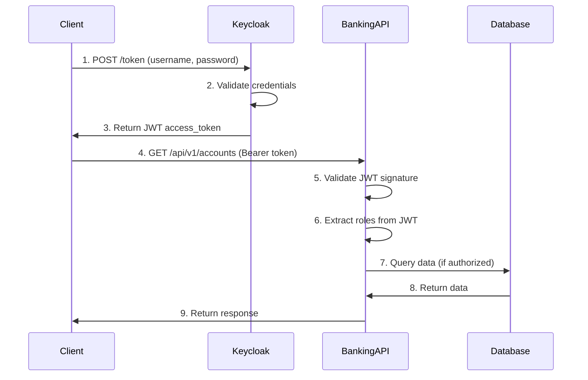

# Authentication Guide

This document explains the OAuth2/JWT authentication system used in the Java Banking Core application.

## Overview

The application uses **OAuth2 with JWT tokens** for authentication, powered by **Keycloak** as the Identity Provider (IdP).

### Authentication Flow



## Getting Started

### 1. Start Keycloak

```bash
# Start only Keycloak and its database
docker-compose up keycloak keycloak-db

# Or start all services
docker-compose up
```

Keycloak Admin Console: http://localhost:8180
- **Username**: admin
- **Password**: admin

### 2. Configure Keycloak

Follow the [KEYCLOAK_SETUP.md](./KEYCLOAK_SETUP.md) guide to:
- Create the `banking-realm`
- Create the `banking-api` client
- Create `ADMIN` and `USER` roles
- Create test users

### 3. Obtain an Access Token

```bash
# Get token for admin user
curl -X POST http://localhost:8180/realms/banking-realm/protocol/openid-connect/token \
  -H "Content-Type: application/x-www-form-urlencoded" \
  -d "client_id=banking-api" \
  -d "grant_type=password" \
  -d "username=admin_user" \
  -d "password=admin123"
```

**Example Response:**
```json
{
  "access_token": "eyJhbGciOiJSUzI1NiIsInR5cCIgOiAiSldUIiwia2lkIiA6ICJxZU...",
  "expires_in": 300,
  "refresh_expires_in": 1800,
  "refresh_token": "eyJhbGciOiJIUzI1NiIsInR5cCIgOiAiSldUIiwia2lkIiA6ICI...",
  "token_type": "Bearer",
  "not-before-policy": 0,
  "session_state": "a1b2c3d4-e5f6-7890-abcd-ef1234567890",
  "scope": "profile email"
}
```

### 4. Use the Token in API Requests

```bash
# Save the token
TOKEN="eyJhbGciOiJSUzI1NiIsInR5cCIgOiAiSldUIiwia2lkIiA6ICJxZU..."

# Create an account (requires ADMIN role)
curl -X POST http://localhost:8080/api/v1/accounts \
  -H "Authorization: Bearer $TOKEN" \
  -H "Content-Type: application/json" \
  -d '{
    "accountType": "ASSET",
    "currency": "BRL"
  }'

# Get account details (requires USER or ADMIN role)
curl -X GET http://localhost:8080/api/v1/accounts/{accountId} \
  -H "Authorization: Bearer $TOKEN"

# Query balances (requires USER or ADMIN role)
curl -X GET http://localhost:8080/api/v1/balances/{accountId} \
  -H "Authorization: Bearer $TOKEN"
```

## Role-Based Access Control

### Available Roles

| Role | Description | Permissions |
|------|-------------|-------------|
| **ADMIN** | Administrator | Full access - can create, read, update, and manage accounts |
| **USER** | Regular User | Read and write access - can view accounts, create transactions, query balances |

### Endpoint Permissions

| HTTP Method | Endpoint | Required Role |
|------------|----------|---------------|
| POST | `/api/v1/accounts` | ADMIN |
| GET | `/api/v1/accounts/**` | USER or ADMIN |
| POST | `/api/v1/accounts/*/block` | ADMIN |
| POST | `/api/v1/accounts/*/unblock` | ADMIN |
| POST | `/api/v1/accounts/*/close` | ADMIN |
| POST | `/api/v1/transactions/**` | USER or ADMIN |
| GET | `/api/v1/balances/**` | USER or ADMIN |
| GET | `/actuator/health` | Public (no auth) |

## JWT Token Structure

### Token Header
```json
{
  "alg": "RS256",
  "typ": "JWT",
  "kid": "qeRtYuIoP"
}
```

### Token Payload
```json
{
  "exp": 1706737372,
  "iat": 1706737072,
  "jti": "4f8b4c8a-1234-5678-90ab-cdef12345678",
  "iss": "http://localhost:8180/realms/banking-realm",
  "sub": "a5b1c2d3-e4f5-6789-0abc-def123456789",
  "typ": "Bearer",
  "azp": "banking-api",
  "realm_access": {
    "roles": ["ADMIN", "USER"]
  },
  "resource_access": {
    "banking-api": {
      "roles": []
    }
  },
  "preferred_username": "admin_user",
  "email": "admin@banking.com",
  "email_verified": true
}
```

### Key Claims

- **iss** (Issuer): Keycloak realm URL
- **sub** (Subject): Unique user ID
- **exp** (Expiration): Token expiration timestamp
- **realm_access.roles**: User's realm-level roles
- **preferred_username**: Username for authentication
- **email**: User's email address

## Token Refresh

When the access token expires (default: 5 minutes), use the refresh token to obtain a new one:

```bash
curl -X POST http://localhost:8180/realms/banking-realm/protocol/openid-connect/token \
  -H "Content-Type: application/x-www-form-urlencoded" \
  -d "client_id=banking-api" \
  -d "grant_type=refresh_token" \
  -d "refresh_token=YOUR_REFRESH_TOKEN"
```

## Testing Authentication

### Test Admin Access

```bash
# Get admin token
ADMIN_TOKEN=$(curl -s -X POST http://localhost:8180/realms/banking-realm/protocol/openid-connect/token \
  -d "client_id=banking-api" \
  -d "grant_type=password" \
  -d "username=admin_user" \
  -d "password=admin123" | jq -r '.access_token')

# Create account (should succeed)
curl -X POST http://localhost:8080/api/v1/accounts \
  -H "Authorization: Bearer $ADMIN_TOKEN" \
  -H "Content-Type: application/json" \
  -d '{"accountType": "ASSET", "currency": "BRL"}'
```

### Test User Access

```bash
# Get user token
USER_TOKEN=$(curl -s -X POST http://localhost:8180/realms/banking-realm/protocol/openid-connect/token \
  -d "client_id=banking-api" \
  -d "grant_type=password" \
  -d "username=test_user" \
  -d "password=user123" | jq -r '.access_token')

# Try to create account (should fail - 403 Forbidden)
curl -X POST http://localhost:8080/api/v1/accounts \
  -H "Authorization: Bearer $USER_TOKEN" \
  -H "Content-Type: application/json" \
  -d '{"accountType": "ASSET", "currency": "BRL"}'

# Get accounts (should succeed)
curl -X GET http://localhost:8080/api/v1/accounts \
  -H "Authorization: Bearer $USER_TOKEN"
```

## Security Best Practices

### 1. Token Storage
- **Web Apps**: Store tokens in httpOnly cookies (not localStorage)
- **Mobile Apps**: Use secure storage (Keychain/KeyStore)
- **Server-to-Server**: Use client credentials flow

### 2. Token Validation
The application automatically validates:
- Token signature (RSA-256)
- Token expiration
- Issuer (must match configured Keycloak realm)
- Token hasn't been tampered with

### 3. HTTPS in Production
Always use HTTPS in production:
```yaml
spring:
  security:
    oauth2:
      resourceserver:
        jwt:
          issuer-uri: https://keycloak.production.com/realms/banking-realm
```

### 4. Environment Variables
Never commit sensitive credentials. Use environment variables:
```bash
export KEYCLOAK_ADMIN_PASSWORD=strong_password_here
export ENCRYPTION_KEY=very_strong_encryption_key_here
```

## Troubleshooting

### 401 Unauthorized

**Possible causes:**
- No token provided
- Token expired
- Invalid token signature
- Wrong issuer

**Solution:**
- Provide valid Bearer token in Authorization header
- Obtain new token if expired
- Verify Keycloak configuration matches application settings

### 403 Forbidden

**Possible causes:**
- User doesn't have required role
- Token is valid but lacks permissions

**Solution:**
- Verify user has correct roles assigned in Keycloak
- Check endpoint requires role user has (e.g., ADMIN vs USER)

### Connection Issues

**Error:** `Unable to load JWK Set from Keycloak`

**Solution:**
- Ensure Keycloak is running: `docker-compose ps keycloak`
- Check network connectivity to Keycloak
- Verify `jwk-set-uri` in application.yaml is correct
- For Docker: Use service name `keycloak` instead of `localhost`

## Migration from Basic Auth

### What Changed

**Before (Basic Auth):**
```bash
curl -u admin:admin123 http://localhost:8080/api/v1/accounts
```

**After (JWT):**
```bash
# Step 1: Get token
TOKEN=$(curl -s -X POST http://localhost:8180/realms/banking-realm/protocol/openid-connect/token \
  -d "client_id=banking-api" \
  -d "grant_type=password" \
  -d "username=admin_user" \
  -d "password=admin123" | jq -r '.access_token')

# Step 2: Use token
curl -H "Authorization: Bearer $TOKEN" http://localhost:8080/api/v1/accounts
```

### Benefits of JWT

1. **Stateless**: No server-side session storage required
2. **Scalable**: Works across multiple application instances
3. **Secure**: Cryptographically signed, tamper-proof
4. **Standard**: Industry-standard OAuth2/OIDC protocol
5. **Decoupled**: Identity management separated from application
6. **Rich Claims**: Carries user information in the token

## Additional Resources

- [Keycloak Setup Guide](./KEYCLOAK_SETUP.md)
- [OAuth2 RFC 6749](https://tools.ietf.org/html/rfc6749)
- [JWT RFC 7519](https://tools.ietf.org/html/rfc7519)
- [Spring Security OAuth2](https://spring.io/guides/tutorials/spring-boot-oauth2/)
